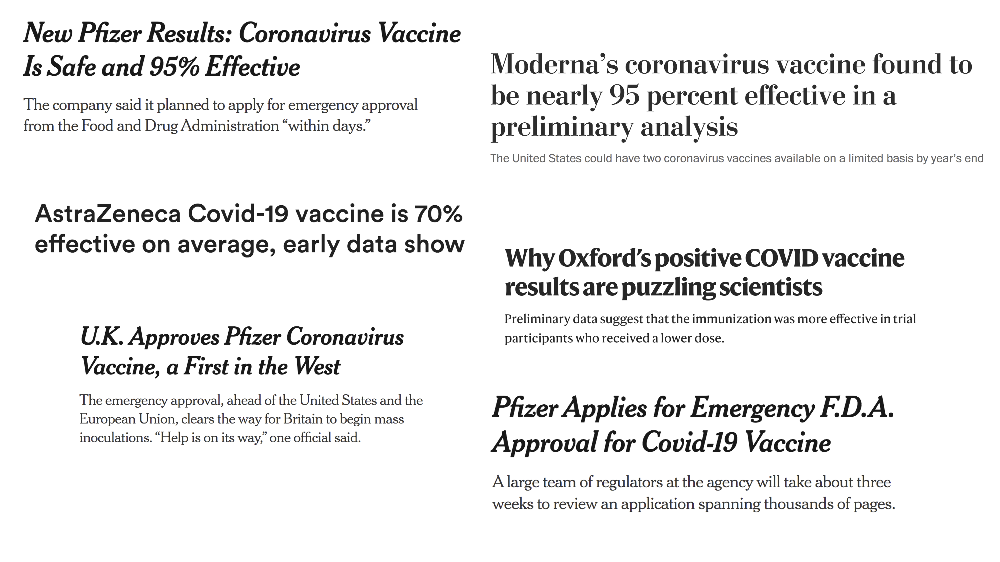
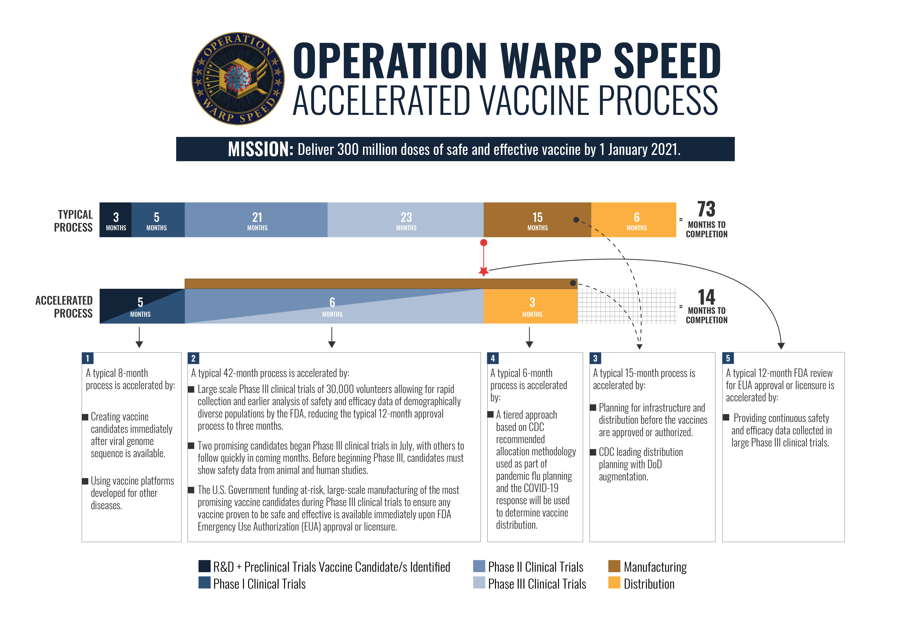
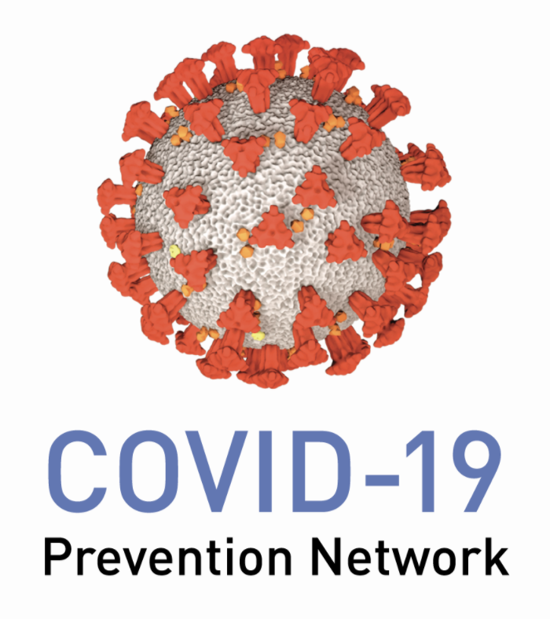
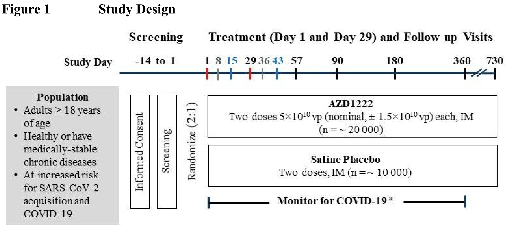
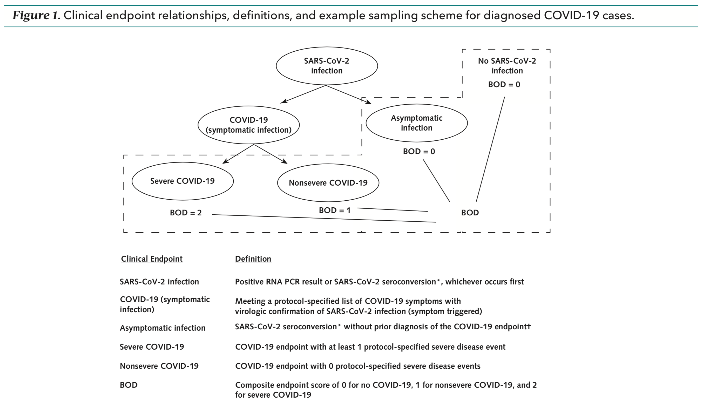
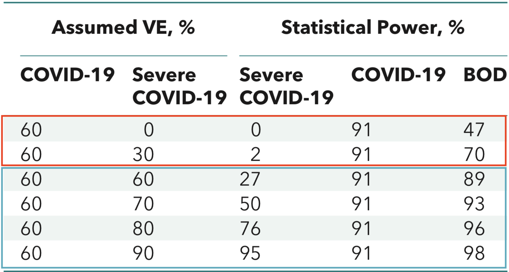
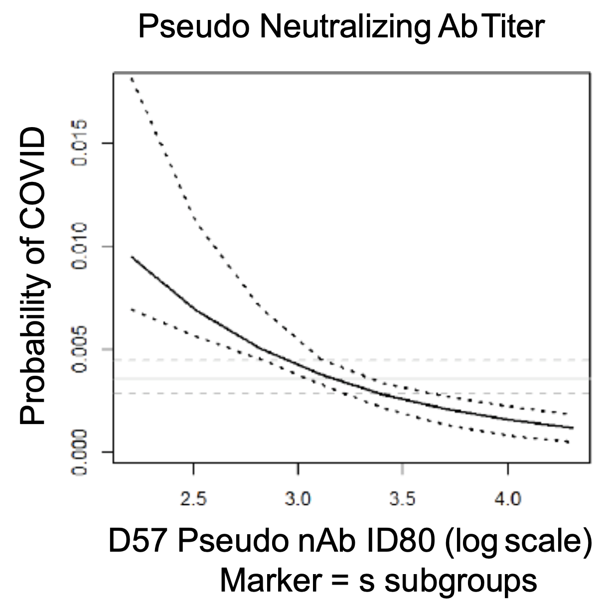
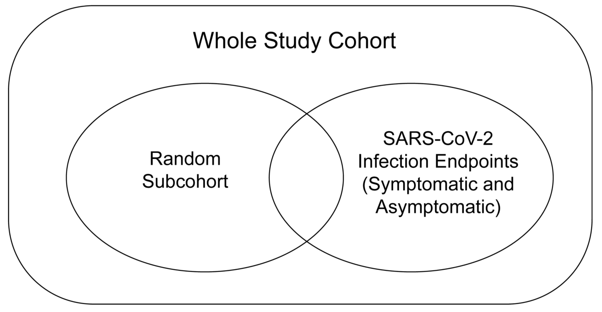

```{r xaringan-themer, include=FALSE, warning=FALSE}
library(xaringanthemer)

extra_css <- list(
  ".inverse" = list(
    `background-image` = "url(img/virusbg.jpeg)",
    `background-size` = "cover"
    ),
  ".small" =  list(`font-size` = "80%"),
  ".tiny" =  list(`font-size` = "70%"),
  ".large" =  list(`font-size` = "150%"),
  ".huge" =  list(`font-size` = "300%"),
  "ul li" = list(`margin-bottom` = "10px"),
  ".gray" = list(color = "#C0C0C0"),
  ".red" = list(color = "#FF0000"),
  ".blue1" = list(color = "#3AABBE"),
  ".blue2" = list(color = "#2A6D90"),
  ".blue3" = list(color = "#446874"),
  ".purple" = list(color = "#624474"),
  ".mutedred" = list(color = "#745344"),
  "a" = list(color = "#3AABBE"),
  "a:hover" = list("text-decoration" = "underline")
)

style_mono_accent(
  base_color = "#446874",
  header_font_google = google_font("DM Sans"),
  text_font_google   = google_font("DM Sans", "400", "400i"),
  code_font_google   = google_font("Courier Prime"),
  extra_css = extra_css
)
```

<style type="text/css">
.remark-slide-content {
    font-size: 22px
}
</style>

## Headline news 

```{r, echo = FALSE, out.height="500px", fig.align="center"}

```
---

```{r, echo = FALSE, out.height="575px", fig.align="center"}

```

.small[from [DoD](https://www.defense.gov/Explore/Spotlight/Coronavirus/Operation-Warp-Speed/)]

???

Two main ways companies can interface with OWS: 
* purchasing/manufacturing funding
* OWS-run trials (agreements through BARDA @ NIH)

---

## COVID-19 Prevention Network

[CoVPN](https://www.coronaviruspreventionnetwork.org/) was [formed by NIAID](https://www.nih.gov/news-events/news-releases/nih-launches-clinical-trials-network-test-covid-19-vaccines-other-prevention-tools) to establish a unified clinical trial network for evaluating vaccines and monoclonal antibodies.

* pooling of resources across __four existing trials networks__
* clinical sites, laboratories, recruitment specialists, statisticians, ...

.pull-left[

```{r, echo = FALSE, out.height="250px", fig.align="center"}

```

]

.pull-right[__Statisticians__ advise on: 

* primary trial __design and analysis__
* sequential __efficacy monitoring__
* __safety__ monitoring
* DSMB/FDA comments
* __immune correlates__

]

---

class: inverse, center, middle

.huge[Design and analysis]

---

## AstraZeneca design

Trial protocols have (unusually) been made publicly available.

* [Moderna](https://www.modernatx.com/sites/default/files/mRNA-1273-P301-Protocol.pdf), [Pfizer](https://pfe-pfizercom-d8-prod.s3.amazonaws.com/2020-09/C4591001_Clinical_Protocol.pdf), [AZ](https://s3.amazonaws.com/ctr-med-7111/D8110C00001/52bec400-80f6-4c1b-8791-0483923d0867/c8070a4e-6a9d-46f9-8c32-cece903592b9/D8110C00001_CSP-v2.pdf), [Janssen](https://www.jnj.com/coronavirus/covid-19-phase-3-study-clinical-protocol)

All Phase III trials are largely similar to this: 

```{r, echo = FALSE, out.height="275px", fig.align="center"}

```

* .small[.red[vaccine], .blue2[immune response], .gray[phone call], clinic visit]

---

## What is primary hypothesis test?

Vaccine efficacy, $\text{VE}$, is the __percent reduction in relative risk__ comparing vaccine to placebo. 

$$
\text{VE} = 1 - \frac{\text{“risk” in vaccine}}{\text{“risk” in placebo}}
$$

* $\text{“risk”}$ of what? See next slides.
* $\text{“risk”}$ quantified by hazard, cumulative incidence, incidence rate, ...
  * in rare event setting, all similar

[FDA guidance](https://www.fda.gov/media/139638/download) (pg. 14) stipulates: 
* a point estimate of $\text{VE}$ for the primary endpoint of at
least 50% __and__ 
* lower bound of an appropriately adjusted confidence interval >30%.
* overall type I error control for one-sided test at 2.5%. 

---

## What is the most relevant endpoint?

```{r, echo = FALSE, out.height="400px", fig.align="center"}

```

<br>

.small[[Mehrotra et al (2020)](https://www.doi.org/10.7326/M20-6169)]

---

## What is the most relevant endpoint?

__SARS-CoV-2 infection__
* .blue2[+] relevant to stemming spread, many infections will be observed
* .red[-] clinically relevant? measured coarsely in time; many false positives

__COVID__
* .blue2[+] more clinically relevant, reasonable number of cases expected
* .red[-] clinically relevant if symptoms are mild?

__Severe COVID__
* .blue2[+] most clinically relevant, a-priori highest expected efficacy
* .red[-] very few cases expected to be observed, longer evaluation needed

---

## What is the most relevant endpoint?

__Burden of disease (BOD)__
* .blue2[+] more clinically relevant than COVID
* .blue2[+] lower power for .red[vaccines of questionable benefit]
* .blue2[+] power at least as high as COVID for .blue1[likely vaccine profiles]
* .red[-] best way to assign burden score? treating ordinal as continuous 🤷‍♂️

```{r, echo = FALSE, out.height="250px", fig.align="center"}

```

---

## What is the most relevant endpoint?

[FDA guidance](https://www.fda.gov/media/139638/download) (pg. 13) states __either COVID or SARS-CoV-2 infection__ is an acceptable primary endpoint.
  *  OWS guidance to companies has been that __infection alone__ is __not acceptable__ as primary endpoint. 

<br> 

FDA guidance states companies, "should consider __powering efficacy trials__ for formal hypothesis testing on a __severe COVID endpoint__ [or] evaluate as a __secondary endpoint__."
  * Only Janssen so far is powering for severe COVID as primary.


---
class: inverse, center, middle

.huge[Reported results]

---

## Results

|__Company__ | __VE COVID__ <br> __(95% CI)__ | __Cases__ <br> __(vax:placebo)__ | __VE Severe__ <br> __(95% CI)__ | __Cases__ <br> __(vax:placebo)__ | 
|:-----------|:---------------------------------------:|:------------------------:|:-----------:|:----:|
| [Pfizer/BioNTech](https://www.pfizer.com/news/press-release/press-release-detail/pfizer-and-biontech-conclude-phase-3-study-covid-19-vaccine) |  94.6 <br> (90.0, 97.9) | 170 <br> (8:162)   |  88.9 <br> (19.8, 99.7) | 10 <br> (1:9)  | 
| [Moderna](https://investors.modernatx.com/news-releases/news-release-details/moderna-announces-primary-efficacy-analysis-phase-3-cove-study)        |  94.1 <br> (89.1, 97.0) | 196 <br> (11:185)  |  100.0 <br> (86.9, 100.0) | 30 <br> (0:30) |
| [Oxford/](https://www.astrazeneca.com/media-centre/press-releases/2020/azd1222hlr.html) <br> [AstraZeneca](https://www.astrazeneca.com/media-centre/press-releases/2020/azd1222hlr.html) (low) | 90.0 <br> (63.9, 97.8)| 33 <br> (3:30)     |  100.0 <br> (??.?, ??.?) | ?? <br> (0:??) |
| [Oxford/](https://www.astrazeneca.com/media-centre/press-releases/2020/azd1222hlr.html) <br> [AstraZeneca](https://www.astrazeneca.com/media-centre/press-releases/2020/azd1222hlr.html) (full) |  61.9 <br> (40.0, 76.5)| 98 <br> (27:71) |  100.0 <br> (??.?, ??.?) | ?? <br> (0:??) |
| [Sputnik](https://clinicaltrials.gov/ct2/show/NCT04530396?term=Gam-COVID-Vac&draw=2) | 91.7 <br> (77.7, 97.4) | 20 <br> (4:16) | ???.? (??.?, ??.?) | ?? <br> (0:??) |
.small[__VE COVID__ reported in press releases. __CI__ roughly computed based on case splits.]

---

class: inverse, center, middle

.huge[Vaccine correlates]

---

## Correlates of risk/protection

Two, interrelated goals of correlates analysis are to 

* identify/validate possible __surrogate endpoints__;
* understand __protective mechanisms__ of vaccines. 

If an __immune correlate__ is established to __reliably predict vaccine efficacy__, then subsequent efficacy trials may use the CoP as the __primary endpoint__. 

__Accelerates approval__ of

* existing vaccines in __different populations__ (e.g., children);
* __new vaccines__ in the same class.

---

## Correlates of risk/protection

.large[__Two levels of correlates analysis__\*:]

__Correlates of risk:__

* Correlation of immune response in vaccine recipients with outcome
* Risk prediction
* Evaluates associative parameters

__Correlates of protection__

* Evaluate immune response's ability to predict vaccine efficacy
* Evaluates causal parameters

<br> <br> <br> 

.small[\* [Plotkin and Gilbert (2012)](https://doi.org/10.1093/cid/cis238), [Qin et al (2007)](https://doi.org/10.1086/522428)]

---

## Correlates of risk


.pull-left[

```{r, cor1, echo = FALSE, out.height = "250px", fig.align = "center"}

```

* Risk given immune response + baseline covariate adjustment
* E.g., Cox model

]

.pull-right[

```{r, cor2, echo = FALSE, out.height = "250px"}
knitr::include_graphics("img/cor2.png")
```

* Machine learning prediction using different sets of immune responses.\*

]

<br> <br> 

.small[\* [Neidich et al (2019)](https://doi.org/10.1172/JCI126391)]

---

## Correlates of protection

__Effect modifiers of VE__

* How/does VE vary across subgroups defined by immune response?
* E.g., [Juraska et al (2020)](https://doi.org/10.1093/biostatistics/kxy074)


__Mediators of VE__

* What percentage of VE is attributable to immune response?
* E.g., [Cowling et al (2019)](https://doi.org/10.1093/cid/ciy759)


__Stochastic interventional VE__

* How/would shifting the immune response distribution impact VE?
* [Hejazi et al (2020)](https://doi.org/10.1111/biom.13375)

---

## Measuring correlates

Running assays on >30k samples is .red[expensive] and __statistically unnecessary__.

Instead we use a __case-cohort design__ ([Prentice, 1986](https://www.jstor.org/stable/2336266?seq=1)) to __measure immune responses__ in 
* a stratified random subcohort (\~1600 individuals)
* all SARS-CoV-2 endpoints

```{r, casecohortplot, echo = FALSE, out.height = "250px", fig.align = "center"}

```

---

## Statistical challenges

__Estimation in two-phase designs__

* Individuals who contract COVID may __differ from other participants__.
* Two-phase design .red[over-samples] these individuals.
* Augmented/inverse weighting approaches to __account for differences__.

<br> 

__Low case numbers due to highly effective vaccines__

* Power for CoP analysis driven by __vaccine breakthroughs__.
* There were .red[only 11 breakthroughs] in Moderna!
* Need to be __judicious__ in which analyses are performed. 
* Ultimately, __establishment of correlate__ will need to additionally draw from __other sources of data__.

---

## Transparency and reproducibility

__CoVPN statisticians are committed to open science.__

An in-progress, version-controlled SAP is [available](https://figshare.com/articles/online_resource/CoVPN_COVID-19_Vaccine_Efficacy_Trial_Immune_Correlates_SAP/13198595) for review.

An __open-source R package__ is being developed to implement methods involved in the SAP. 

* Reproducible reports using R Markdown
* Vignettes including analysis of simulated data

Release of package and first correlates reports expected in __early 2021__.

---

## Concluding thoughts

Can we __trust__ the vaccine development process?

* Unequivocally, yes. Safety of vaccines is __aggressively monitored__. 

Efficacy results thus far are __overwhelmingly positive__.

* I am still in shock.

The story is not (close to) over. __There is still much to do and learn__!

* Community outreach/education to increase uptake
* Durability of vaccines
* Efficacy against infection/transmissibility
* Designs when placebo controls are not possible/ethical
* ...

---

## Amazing statisticians

.pull-left[.tiny[
__Leadership__
* Dean Follmann (NIAID)
* Yonghong Gao (BARDA)
* Peter Gilbert (FHCRC, UW)

__NIAID__
* Martha Nason
* Mike Fay
* Prett much all of NIAID Biostatistics

__CoVPN__
* Alex Luedtke (UW)
* Marco Carone (UW)
* Iván Díaz (Weill-Cornell)
* Nima Hejazi (Berkeley)
* many others!

]]

.pull-right[.tiny[
__Fred Hutch__
* Holly Janes
* Youyi Fong
* Yunda Huang
* Michal Juraska
* Ying Huang
* Ollivier Hyrien
* many others!

__OWS Company statisticians__
* Too many to name!
]
]
