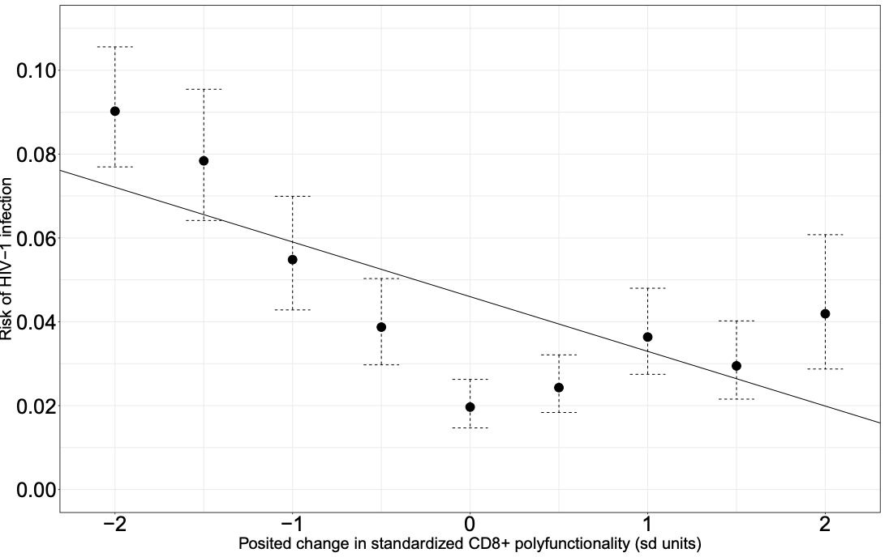

```{r xaringan-themer, include=FALSE, warning=FALSE}
library(xaringanthemer)

extra_css <- list(
  ".inverse" = list(
    `background-image` = "url(img/virusbg.jpeg)",
    `background-size` = "cover"
    ),
  ".small" =  list(`font-size` = "80%"),
  ".large" =  list(`font-size` = "150%"),
  ".huge" =  list(`font-size` = "300%"),
  "ul li" = list(`margin-bottom` = "10px"),
  ".gray" = list(color = "#C0C0C0"),
  ".red" = list(color = "#FF0000"),
  ".blue1" = list(color = "#3AABBE"),
  ".blue2" = list(color = "#2A6D90"),
  ".blue3" = list(color = "#446874"),
  ".purple" = list(color = "#624474"),
  ".mutedred" = list(color = "#745344"),
  "a" = list(color = "#3AABBE"),
  "a:hover" = list("text-decoration" = "underline")
)

style_mono_accent(
  base_color = "#446874",
  header_font_google = google_font("DM Sans"),
  text_font_google   = google_font("DM Sans", "400", "400i"),
  code_font_google   = google_font("Courier Prime"),
  extra_css = extra_css
)
```

<style type="text/css">
.remark-slide-content {
    font-size: 22px
}
</style>

## SARS-CoV-2 Infection

```{r, echo = FALSE, out.height="450px", fig.align="center"}

```

.small[from [Washington Post](https://www.washingtonpost.com/graphics/2020/health/covid-vaccine-update-coronavirus/)]

---

## Nucleic acid vaccines

```{r, echo = FALSE, out.height="300px", fig.align="center"}

```
.pull-left[.center[
__Examples__: 

Moderna (mRNA)

Pfizer (mRNA)
]]

.pull-right[.center[
.blue2[+] Quick manufacturing

.red[-] Potentially challenging cold chain

.red[-] Never been approved before
]]

???

Figures again borrowed from WaPo. See also the [Nature news article](https://www.nature.com/articles/d41586-020-01221-y) about COVID vaccines. 

---

## Viral-vectored vaccines

```{r, echo = FALSE, out.height="300px", fig.align="center"}

```
.pull-left[.center[
__Examples__: 

AstraZeneca (chimp adeno)

Janssen (human adeno)
]]

.pull-right[.center[
.blue2[+] Quick manufacturing

.red[-] Immunity against vector 

.red[-] Unintentional effects on <a href="https://www.thelancet.com/journals/lancet/article/PIIS0140-6736(20)32156-5/fulltext"> HIV risk</a>?
]]

---

## Subunit vaccines

```{r, echo = FALSE, out.height="300px", fig.align="center"}

```
.pull-left[.center[
__Examples__: 

NovaVax

Sanofi Pasteur/GSK 
]]

.pull-right[.center[
.blue2[+] Construct of several effective vaccines (hep B, HPV, ...)

.red[-] Slower manufacturing

.red[-] Often require an adjuvant
]]

---

## Weakened/inactivated vaccines

```{r, echo = FALSE, out.height="300px", fig.align="center"}

```
.pull-left[.center[
__Examples__: 

Sinopharm

Sinovac
]]

.pull-right[.center[
.blue2[+] Construct of several effective vaccines (MMR, polio, flu)

.red[-] Slower manufacturing

.red[-] Often require an adjuvant
]]

---

```{r, echo = FALSE, out.height="575px", fig.align="center"}
knitr::include_graphics("img/owsprocess.jpeg")
```

.small[from [DoD](https://www.defense.gov/Explore/Spotlight/Coronavirus/Operation-Warp-Speed/)]

???

Two main ways companies can interface with OWS: 
* purchasing/manufacturing funding
* OWS-run trials (agreements through BARDA @ NIH)

---

## COVID-19 Prevention Network

[CoVPN](https://www.coronaviruspreventionnetwork.org/) was [formed by NIAID](https://www.nih.gov/news-events/news-releases/nih-launches-clinical-trials-network-test-covid-19-vaccines-other-prevention-tools) to establish a unified clinical trial network for evaluating vaccines and monoclonal antibodies.

* pooling of resources across __four existing trials networks__
* clinical sites, laboratories, recruitment specialists, statisticians, ...

.pull-left[

```{r, echo = FALSE, out.height="250px", fig.align="center"}
knitr::include_graphics("img/covpn.png")
```

]

.pull-right[__Statisticians__ advise on: 

* primary trial __design and analysis__
* sequential __efficacy monitoring__
* __safety__ monitoring
* DSMB/FDA comments
* __immune correlates__

]

---
class: inverse, center, middle

.huge[Design and analysis]

---

## AstraZeneca design

Trial protocols have (unusually) been made publicly available.

* [Moderna](https://www.modernatx.com/sites/default/files/mRNA-1273-P301-Protocol.pdf), [Pfizer](https://pfe-pfizercom-d8-prod.s3.amazonaws.com/2020-09/C4591001_Clinical_Protocol.pdf), [AZ](https://s3.amazonaws.com/ctr-med-7111/D8110C00001/52bec400-80f6-4c1b-8791-0483923d0867/c8070a4e-6a9d-46f9-8c32-cece903592b9/D8110C00001_CSP-v2.pdf), [Janssen](https://www.jnj.com/coronavirus/covid-19-phase-3-study-clinical-protocol)

All Phase III trials are largely similar to this: 

```{r, echo = FALSE, out.height="275px", fig.align="center"}
knitr::include_graphics("img/azdesign.png")
```

* .small[.red[vaccine], .blue2[immune response], .gray[phone call], clinic visit]

---

## What is primary hypothesis test?

Vaccine efficacy, $\text{VE}$, is the __percent reduction in relative risk__ comparing vaccine to placebo. 

$$
\text{VE} = 1 - \frac{\text{“risk” in vaccine}}{\text{“risk” in placebo}}
$$

* $\text{“risk”}$ of what? See next slides.
* $\text{“risk”}$ quantified by hazard, cumulative incidence, incidence rate, ...
  * in rare event setting, all similar

[FDA guidance](https://www.fda.gov/media/139638/download) (pg. 14) stipulates: 
* a point estimate of $\text{VE}$ for the primary endpoint of at
least 50% __and__ 
* lower bound of an appropriately adjusted confidence interval >30%.
* overall type I error control for one-sided test at 2.5%. 

---

## How is $\text{VE}$ estimated/tested?

|__Company__ | __Estimation approach__                     |
|:-----------|:--------------------------------------------|
|Pfizer      |Bayesian beta-binomial                       |
|Moderna     |Cox model                                    |
|AZ          |Poisson regression model                     |
|Janssen     |Binomial + sequential probability ratio test |

<br> 

Simulation studies showed __little difference in power__ across approaches. 

---

## What is the most relevant endpoint?

```{r, echo = FALSE, out.height="400px", fig.align="center"}

```

<br>

.small[from Mehrotra et al doi: [10.7326/M20-6169](https://www.doi.org/10.7326/M20-6169)]

---

## What is the most relevant endpoint?

__SARS-CoV-2 infection__
* .blue2[+] relevant to stemming spread, many infections will be observed
* .red[-] clinically relevant? measured coarsely in time; many false positives

__COVID__
* .blue2[+] more clinically relevant, reasonable number of cases expected
* .red[-] clinically relevant if symptoms are mild?

__Severe COVID__
* .blue2[+] most clinically relevant, a-priori highest expected efficacy
* .red[-] very few cases expected to be observed, longer evaluation needed

---

## What is the most relevant endpoint?

__Burden of disease (BOD)__
* .blue2[+] more clinically relevant than COVID
* .blue2[+] lower power for .red[vaccines of questionable benefit]
* .blue2[+] power at least as high as COVID for .blue1[likely vaccine profiles]
* .red[-] best way to assign burden score? treating ordinal as continuous 🤷‍♂️

```{r, echo = FALSE, out.height="250px", fig.align="center"}

```

---

## What is the most relevant endpoint?

[FDA guidance](https://www.fda.gov/media/139638/download) (pg. 13) states __either COVID or SARS-CoV-2 infection__ is an acceptable primary endpoint.
  *  OWS guidance to companies has been that __infection alone__ is __not acceptable__ as primary endpoint. 

<br> 

FDA guidance states companies, "should consider __powering efficacy trials__ for formal hypothesis testing on a __severe COVID endpoint__ [or] evaluate as a __secondary endpoint__."
  * Only Janssen so far is powering for severe COVID as primary.


---
class: inverse, center, middle

.huge[Results (so far)]

---

## Placeholder

A table summarizing Phase III trial results so far (Pfizer, Moderna, AZ)

---

class: inverse, center, middle

.huge[Vaccine correlates]

---

## Correlates of protection

```{r, cor-fig, echo = FALSE, out.height="400px", fig.align = "center"}

```

.small[From Plotkin and Gilbert, doi: [10.1093/cid/cis238](https://doi.org/10.1093/cid/cis238)]

---

## Correlates of protection

If an CoP is established to __reliably predict vaccine efficacy__, then subsequent efficacy trials may use the CoP as the __primary endpoint__. 

Accelerates approval for: 

* different populations (e.g., children, pregnant women);
* new vaccines in the same class in same/different populations.

<br> 

In effect: 

.center[.large[__A CoP is a candidate surrogate endpoint.__]]

---

## Measuring correlates

Running assays on >30k samples is .red[expensive] and __statistically unnecessary__.

Instead we __measure immune responses__ in:

* a stratified random subcohort (\~1600 individuals)
* all SARS-CoV-2 and COVID endpoints

This is a __case-cohort design__ ([Prentice, 1986](https://www.jstor.org/stable/2336266?seq=1)), a special case of a __two-phase sampling design__ ([Breslow, 2009](https://academic.oup.com/aje/article/169/11/1398/159218)).

* Phase 1: measure baseline variables, vaccine, endpoint __on everyone__
* Phase 2: given baseline, vaccine, endpoint, select members of __immune response subcohort__ with some (known) probability

---

## Placeholder

A slide with high-level heuristics about correlates: 
* causal sufficiency, causal mediation

---

## Estimation in two-phase designs

.pull-left[
* $W$ = baseline covariates
* $A$ = vaccine assignment
* $Y$ = COVID endpoint
]

.pull-right[
* $\Delta$ = indicator of being in immune response subcohort
* $\Delta S$ = measure of immune responses $S$
]

Suppose we are interested in $E(S)$. Use __Horvitz-Thompson/IPTW estimator__: $$
\hat{\mu} = \frac{1}{n}\sum_{i=1}^n \frac{\Delta_i}{P(\Delta = 1 \mid W_i, A_i, Y_i)} S_i \ . 
$$

More efficient to use __augmented estimator__: 
$$
\hat{\mu} + \frac{1}{n}\sum_{i=1}^n \left(1 - \frac{\Delta_i}{P(\Delta = 1 \mid W_i, A_i, Y_i)} \right) \hat{E}(S \mid \Delta = 1, A_i, W_i, Y_i) \ . 
$$

???

Intuition: if $Y$ or $W$ is perfectly predictive of $S$, then $\hat{E}(S \mid \Delta = 1, A_i, W_i, Y_i)$ is like imputing the true value. So it's like we measured $S$ on more people!

It turns out that consistency of $\hat{\mu}$ is not impacted by model for $S$ -- double robustness.

---

## Estimation in two-phase designs

This augmented approach [generalizes](https://www.ncbi.nlm.nih.gov/pmc/articles/PMC3083136/). In [Hejazi et al, 2020](https://onlinelibrary.wiley.com/doi/abs/10.1111/biom.13375?af=R) we study $$
\psi_{\delta} = E[P(Y = 1 \mid A = 1, W, S = S + \delta)] \ .
$$

With assumptions, $\psi_{\delta}$ = __counterfactual risk__ with vaccine AND $\delta$ change in $S$. 

.pull-left[

```{r, shiftplot, echo = FALSE, out.height = "250px", fig.align = "center"}

```

]

.pull-right[

* examine over a range of $\delta$ and summarize by projecting onto working model

* compare to risk in placebo for controlled effects-type parameter

]

---

## Placeholder

Challenges for correlates in face of highly effective vaccines
* low case numbers, stability of estimators?

Establishment of correlate will have to draw from NHP studies, natural infection data, other sources.

---

## Placeholder

Topics for discussion/open questions:
* Durability -- will we be able to continue blinded, placebo-controlled follow-up
  * I'm basically hearing the answer is "No!"
* Long term safety -- people still seem skeptical of mRNA vaccines wrt long term outcomes
* Bridging to children
* Importance of VE against infection


